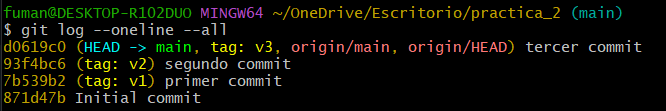
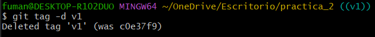
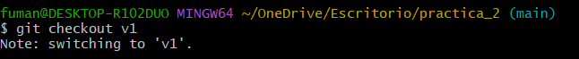
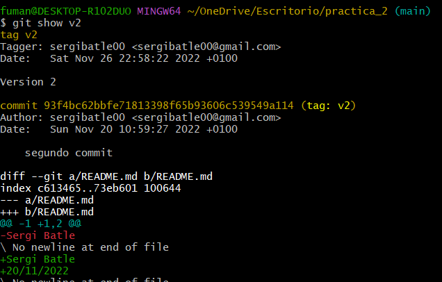
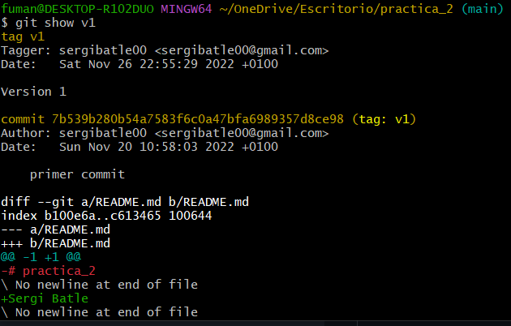
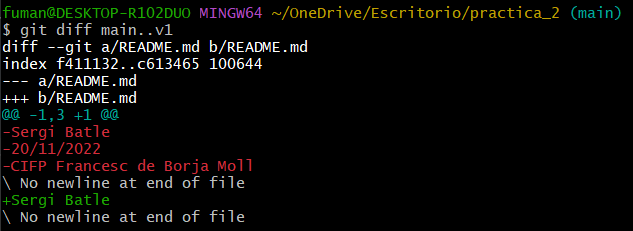

# Etiquetar commits y ver diferencias

## 1. Etiquetamos el commit primero y el tercero.

El primer commit será la versión 1 de nuestro proyecto. La etiqueta será v1.

El segundo commit será la versión 2 de nuestro proyecto. La etiqueta será v2.

Para etiquetar utilizamos el comando

```
git  tag  -a  nombre_etiqueta  -m  "Mensaje"   commit_a_etiquetar
```

Por ejemplo:

```
git tag  -a v1  -m "Versión 1"  7b539b2
git tag  -a v2  -m "Versión 2"  93f4bc6
```



Si por cualquier motivo nos equivocamos al crear la etiqueta podemos eliminarla con

```
git tag -d nombre_etiqueta
```



## 2. Usando etiquetas para movernos

Las etiquetas nos permiten referenciar commits de una forma más cómoda que usando el identificador de hash.

Por ejemplo:



## 3. Examinado cambios de un commit respecto al anterior.

Para ver los cambios introducidos respecto al commit anterior hacemos:

```
git show
```

Si solo ponemos git show nos mostrará los cambios del commit en el que estemos habiendo usado git checkout [commit] respecto al commit anterior

En mi caso voy a usar git show v2 para ver los cambios del segundo commit respecto al primero



Usando git show v1 podemos ver los cambios del primer commit respecto al readme vacio



## 4. Diferencias entre varios commits

Usando el comando git dif podemos ver las diferencias entre una serie de commits:

```
git diff main..v1
```



Así podemos ver los cambios del ultimo commit respecto al primero

## 5. Diferencia entre git show y git diff

La diferencia es que usando git show podemos ver los cambios del commit seleccionado respecto al commit anterior a este y con git diff podemos ver los cambios entre una serie de commits


